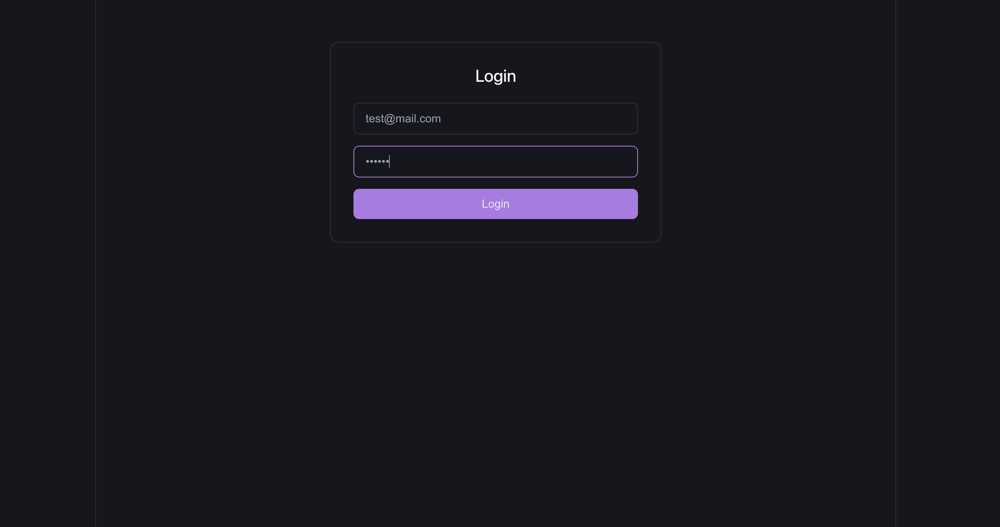
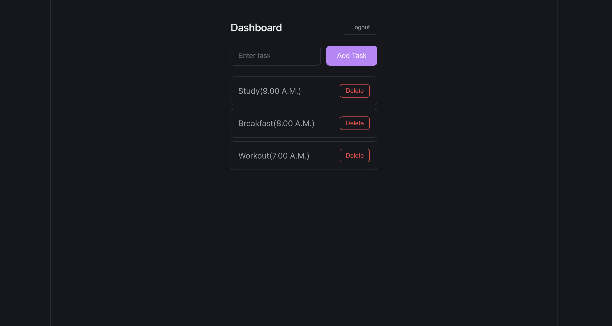

# 🚀 Full Stack Authentication System (Laravel + React + JWT)

## 📌 Overview

This project is a full-stack authentication system built using **Laravel (Backend)** and **React (Frontend)** with **JWT-based authentication**. It includes secure login, protected routes, and a task management dashboard with CRUD functionality.

---

## 🛠️ Tech Stack

### Backend

* Laravel
* JWT Authentication (tymon/jwt-auth)
* SQLite

### Frontend

* React (Vite)
* Axios
* React Router

---

## 🔐 Features

### Authentication

* User Registration (API)
* User Login (JWT आधारित authentication)
* Token-based authentication
* Protected routes (Backend + Frontend)

### Task Management (CRUD)

* Create Task
* View Tasks
* Delete Task
* Secure API access using JWT

---

## 📁 Project Structure

```
auth-backend/
frontend/
```

---

## ⚙️ Backend Setup (Laravel)

```bash
cd auth-backend
composer install
cp .env.example .env
php artisan key:generate
php artisan jwt:secret
```

### Database Setup

```bash
touch database/database.sqlite
php artisan migrate
```

### Run Server

```bash
php artisan serve
```

---

## 🌐 Frontend Setup (React)

```bash
cd frontend
npm install
npm run dev
```

---

## 🔑 API Endpoints

### Auth

| Method | Endpoint             | Description       |
| ------ | -------------------- | ----------------- |
| POST   | `/api/auth/register` | Register user     |
| POST   | `/api/auth/login`    | Login & get token |

---

### Tasks (Protected)

| Method | Endpoint          | Description |
| ------ | ----------------- | ----------- |
| GET    | `/api/tasks`      | Fetch tasks |
| POST   | `/api/tasks`      | Create task |
| DELETE | `/api/tasks/{id}` | Delete task |

---

## 🔐 Authentication Usage

Include token in headers:

```
Authorization: Bearer YOUR_TOKEN
```

---

## 🧪 Testing

* Registration tested via Postman
* Login & Task CRUD tested via frontend
* Protected routes verified

---

## 📌 Key Highlights

* Clean folder structure
* JWT-based secure authentication
* Proper API integration
* Modular and maintainable code
* Step-by-step Git commits

---

## 🚀 Future Improvements

* Task update feature
* Better UI/UX
* Form validation
* Register page in frontend

---

## 📡 API Examples

### Login

POST /api/auth/login

Request:
{
  "email": "test@mail.com",
  "password": "123456"
}

Response:
{
  "token": "jwt_token_here"
}

---
## 📸 Screenshots

### 🔐 Login Page


### 📊 Dashboard


### ➕ Task Creation


## 👨‍💻 Author

Dhruv Rajput

---


## 📎 Notes

* Ensure backend is running before frontend
* Use Postman for initial user registration
* Token is stored in localStorage for authentication
